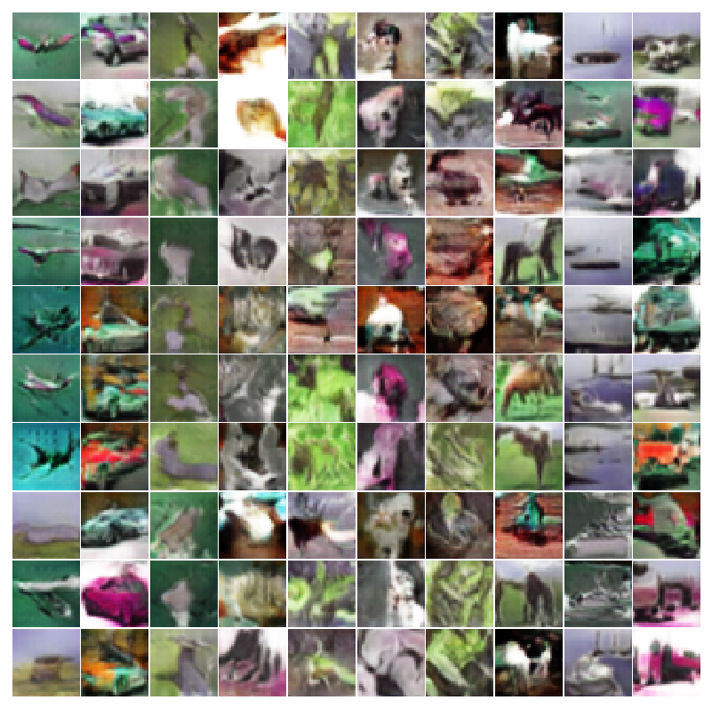

# Understanding CNNs and Generative Adversarial Networks
Implemented GAN and understand the property and features of CNN model.
What does CNN actually learn?

# Train Time

Using one node on Bluewater(UIUC Supercomputer) cost:
~45 hours for GAN_discriminator_With_Generator.py, acc on cifar10, 83.89%
~2 hours for Discriminator_Without_Generator.py, acc on cifar10, 88.0600%'s
It's normal to have a GAN discriminator result in lower acc than discriminator without generator 

# cifar10 real images
Here is example of cifar10 dataset's real images

# GAN Result
## first epochs example

## 25th epochs example

## 150 epochs example

# Train
