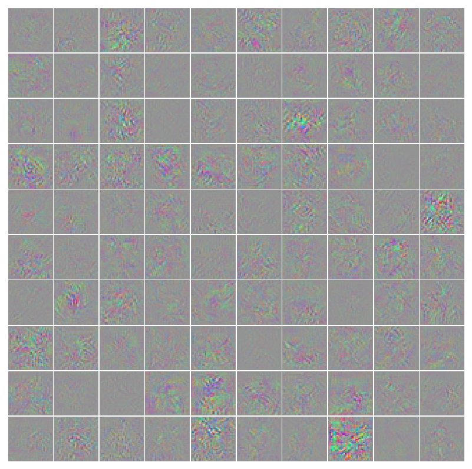
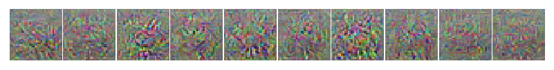
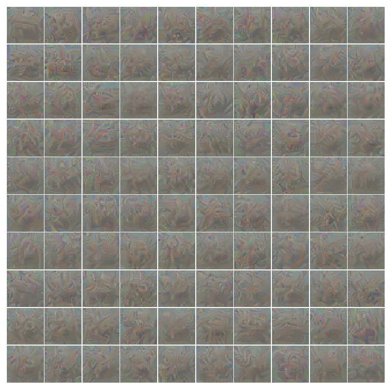

# Understanding CNNs and Generative Adversarial Networks
Implemented GAN and understand the property and features of CNN model.
What does CNN actually learn?

# Train Time

Using one node on Bluewater(UIUC Supercomputer) cost:
~45 hours for GAN_discriminator_With_Generator.py, acc on cifar10, 83.44% in epoch 200, 
max acc: 85.02768987341773 in epoch 199
~2 hours for Discriminator_Without_Generator.py, acc on cifar10, 88.0600%'s
It's normal to have a GAN discriminator result in lower acc than discriminator without generator 

# cifar10 real images
Here is example of cifar10 dataset's real images

# GAN Result
## 1st epochs example

## 50th epochs example

## 100 epochs example

## 150 epochs example

## 200 epochs example

## 

# Perturb Real Image
A batch of real images, a batch of the gradients from an alternate class for these images, and the modified images the discriminator incorrectly classifies.

## Real Image
Here is example of cifar10 dataset's real images

## Real Image
Here is example of cifar10 dataset's real images

## Gradient image

## modified image, jittered

# Synthetic Images Maximizing Classification Output
## Synthetic image without generator

## Synthetic image with generator

# Synthetic Features Maximizing Features at Various Layers
From this part. Synthetic images maximizing a particular layer of features. Do this for at least two different layers.
Here I did layer 2 and layer 7 for both discriminator

## For discriminator without Generator
Layer2

Layer7

## For discriminator with Generator
Layer2

Layer7

